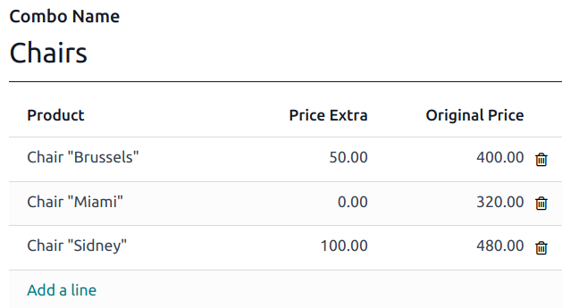
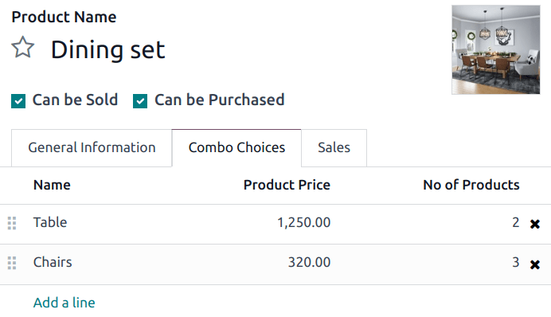
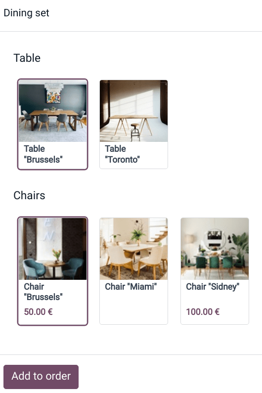
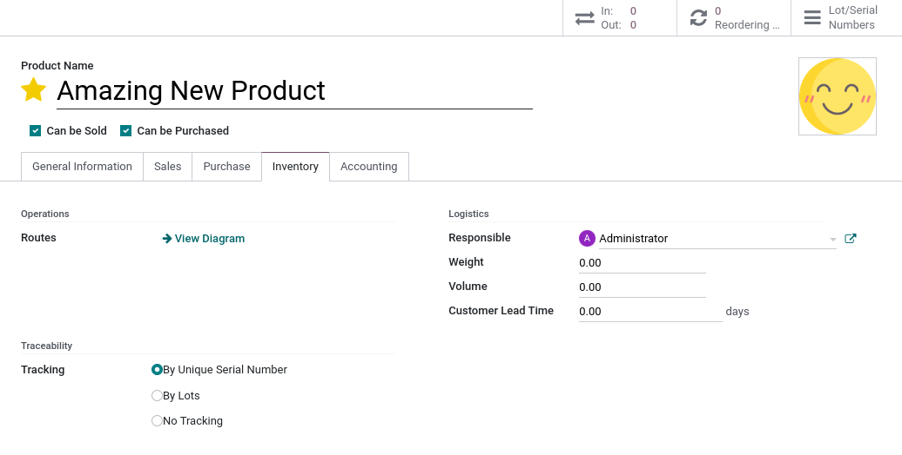
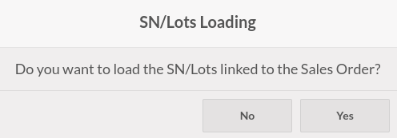
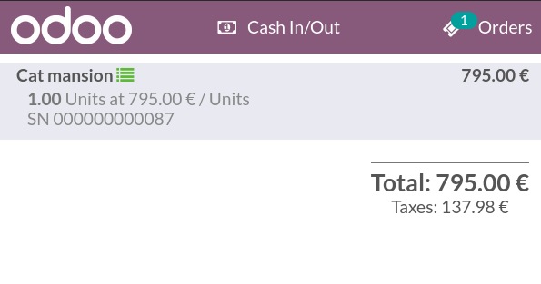
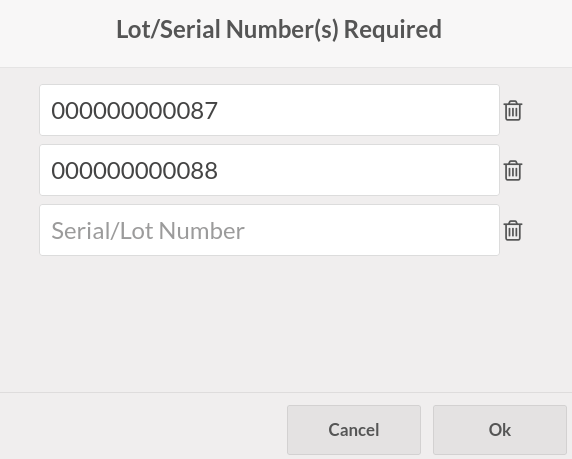

========
Products
========

Products can be created from the backend or the POS interface. To manage products from the backend,
go to :menuselection:`Point of Sale --> Products --> Products`. Click :guilabel:`New` to create a
product, or open an existing one to edit it. Update the fields as needed and ensure the
:guilabel:`Point of Sale` checkbox is enabled at the top of the form.

To create products from the POS interface, access the POS register, click the :icon:`fa-bars`
(:guilabel:`hamburger menu`) icon, then :guilabel:`Create Product`. Enter the product details in the
pop-up window and click :guilabel:`Save`. The product is immediately available in the register.

To update an existing product from the POS register, long-click a product to open the information
pop-up, and click :guilabel:`Edit`. Change the necessary product details and click :guilabel:`Save`
to return to the POS register.

.. _pos/products/categories:

POS product categories
======================

POS product categories are used to organize products in the POS register.

To manage POS categories, follow these steps:

#. Navigate to :menuselection:`Point of Sale --> Configuration --> PoS Product Categories`.
#. Click :guilabel:`New` to create a category or click an existing one to update it.
#. Classify and build a hierarchy between categories: Associate a category with a parent
   category by filling in the :guilabel:`Parent Category` field. A parent category groups one or
   more child categories (e.g., use `Drinks` to group `Hot beverages` and `Soft drinks`).

Once POS product categories are created, assign them to specific products:

#. Go to :menuselection:`Point of Sale --> Products --> Products` and open a product form.
#. Navigate to the :guilabel:`Point of Sale` tab and fill in the :guilabel:`Category` field with one
   or multiple POS categories.

To limit the categories displayed on the POS register, navigate to the :ref:`POS settings
<pos/use/settings>` and select the relevant categories in the :guilabel:`Restrict Categories` field
under the :guilabel:`Product & PoS categories` section.

.. _pos/products/combos:

Product combos
==============

The **Product Combos** feature allows users to define and manage combination options for a single
product.

In the context of a restaurant, the feature enables users to create multiple-choice menus. For
example, a user can define a main dish and specify various options for sides, drinks, or desserts
that customers can combine with the main dish.

In retail, this feature allows you to create a product set with multiple products to choose from and
combine.

.. _pos/products/configuration:

Configuration
-------------

First, you need to create combination choices. To do so:

#. Go to :menuselection:`Point of Sale --> Products --> Product Combos` and click :guilabel:`New`.
#. Name your combo and add the products you want customers to choose from by clicking :guilabel:`Add
   a line`. You can also include an extra price for each option in the :guilabel:`Extra Price`
   column.

.. note::
   As a reference, the selected product's original price is displayed in the :guilabel:`Original
   Price` column.

Second, you need to create a specific product to gather combo choices. To do this:

#. Go to :menuselection:`Point of Sale --> Products --> Products` and click :guilabel:`New`.
#. Set the :guilabel:`Product Type` to :guilabel:`Combo` and fill in the  :guilabel:`General
   Information` tab.

   .. note::
      The sales price of the combo product is fixed and does not vary based on the individual prices
      of included items or the quantity of items in the combo. The combo product price is only
      affected by the extra price optionally defined at the combo choice creation or if a variant of
      one of the items has a specified extra price.
#. Go to the :guilabel:`Combo Choices` tab, click :guilabel:`Add a line`, and select the
   combinations to add. You can also create a new combination at this step by clicking
   :guilabel:`New` on the popup window.

Once you have created and added the combo choices into a product, you can sell combos in your retail
store or restaurant.

Practical application
---------------------

:ref:`Access the POS register <pos/use/open-register>` and select the combo product. Choose the
options and click :guilabel:`Add to order`. As a reminder, the extra price appears under the related
choices.

Serial numbers and lots
=======================

Working with **serial numbers** and **lots** allows tracking your products' movements. When products
are tracked, the system identifies their location based on their last movement.

To enable traceability, go to :menuselection:`Point of Sale --> Products --> Products`. Then,
select a product and check the :guilabel:`Tracking By Unique Serial Number` or the
:guilabel:`Tracking By Lots` box in the :guilabel:`Inventory` tab.

Serial numbers and lots importation
-----------------------------------

You can import serial numbers in Point of Sale. To do so, select a **sales order** or a
**quotation** containing tracked products. Then, agree to load the **Lots or Serial Numbers** linked
to the :abbr:`SO (sales order)`.

The imported tracking numbers appear below the tracked products. You can modify them by clicking on
the list-view button next to the products.

.. seealso::
   - :ref:`pos/shop/so`

Serial numbers and lots creation
--------------------------------

If a tracked product is available in your POS, adding the product to the cart opens a pop-up window
where you can type or scan the product's serial or lot numbers. To add more than one of the same
tracked products, click on **enter** to validate and start a new line.

.. note::
   - Changing a tracked product's quantity using the numpad turns the list-view button red. Click on
     it to add the missing lot and serial numbers.
   - :guilabel:`Lot & Serial Number(s)` are :guilabel:`required` on tracked products but not
     mandatory. Meaning that not attributing some or any does **not** prevent from completing the
     sale.

.. seealso::
   - :doc:`/applications/inventory_and_mrp/inventory/product_management/product_tracking/serial_numbers`
   - :doc:`/applications/inventory_and_mrp/inventory/product_management/product_tracking/lots`

