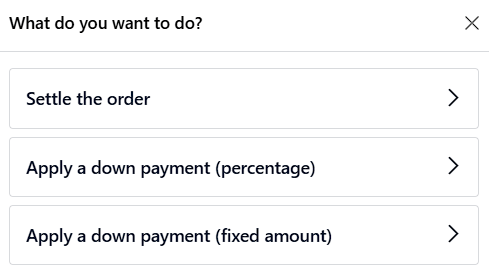
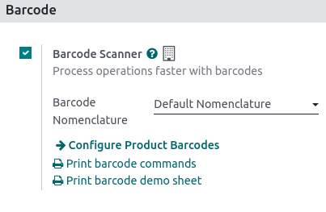
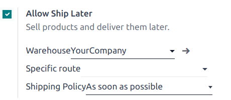
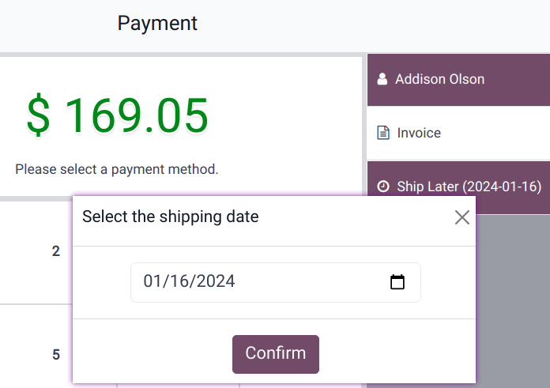

:show-content:

=============
Shop features
=============

.. _pos/shop/so:

Sales orders
============

When working in retail, you might need access sales orders created on the Sales app from the POS
register.

Select a sales order
--------------------

From the POS register the :icon:`oi-ellipsis-v` (:guilabel:`vertical ellipsis`) button and
:icon:`fa-link` :guilabel:`Quotation/Order` to open the list of quotations and sales orders created
from the sales application.

Apply a down payment or settle the order
----------------------------------------

Select a quotation or sales order, and on the popup that open, choose the desired settlement method.
The customer can either:

- Settle the order **completely**: Click :guilabel:`Settle the order` to pay for the total of the
  quotation or sales order.
- Settle the order **partially**:

  #. Select :guilabel:`Apply a down payment (percentage)` or :guilabel:`Apply a down payment
     (fixed amount)` to make a down payment for the selected quotation or sales order.
  #. Enter the percentage or fixed amount the customer is paying, and click :guilabel:`Apply` to add
     the down payment to the cart.

.. note::
   Once a sales order is partially settled, the applied down payment is automatically deducted from
   the total amount.

.. Seealso::
   - :doc:`../sales/sales_quotations`
   - :doc:`../sales/invoicing/down_payment`

Barcodes
========

Using a barcode scanner to process point-of-sale orders improves your efficiency in providing
quicker customer service. Barcode scanners can be used both to scan products or to log employees
into the POS register.

Configuration
-------------

To use a barcode scanner, you must enable the feature in the Inventory app. Go to
:menuselection:`Inventory --> Configuration --> Settings`, in the :guilabel:`Barcode` section, tick
:guilabel:`Barcode Scanner` and save.

.. seealso::
   - :doc:`Set up a barcode scanner </applications/inventory_and_mrp/barcode/setup/hardware>`
   - :doc:`Activate barcode scanners </applications/inventory_and_mrp/barcode/setup/software>`

Once enabled in **Inventory**, you can use the barcode feature in **Point of Sale** with products
that have a barcode number assigned.

Assign barcodes
---------------

To your products
~~~~~~~~~~~~~~~~

To use this feature in POS, your products must have barcodes assigned. To do so, go to
:menuselection:`Point of Sale --> Products --> Products` and open a **product form**. Add a barcode
number in the :guilabel:`Barcode` field in the :guilabel:`General Information` tab.

To your employees
~~~~~~~~~~~~~~~~~

To add an identification number to an employee, go to the **Employees** app and open an **employee
form**. Choose an identification number for your employee and fill in the :guilabel:`PIN Code`
field in the :guilabel:`HR Settings` tab.

Use barcodes
------------

Scan products
~~~~~~~~~~~~~

Scan a product's barcode using a barcode scanner. Doing so adds it directly to the cart. To change
the quantity, scan a product as many times as needed, or click :guilabel:`Qty` and enter the number
of products using the keypad.

You can also enter the barcode number manually in the search bar to look for the product. Then,
click it to add it to the cart.

Log employees
~~~~~~~~~~~~~

You can also use a barcode scanner to log your employees. To do so, :ref:`restrict access
<pos/employee_login/configuration>` to the POS and :ref:`use barcodes to log your employees in
<pos/employee_login/badge>` your POS.

.. _pos/shop/discount-tags:

Discount tags (barcode scanner)
===============================

If you want to sell your products with a discount, for a product getting
close to its expiration date for example, you can use discount tags.
They allow you to scan discount barcodes.

.. note::
   To use discount tags you will need to use a barcode scanner.

Barcode Nomenclature
--------------------

To use discounts tags, we need to learn about barcode nomenclature.

Let's say you want to have a discount for the product with the following
barcode:

You can find the *Default Nomenclature* under the settings of your PoS
interface.

Let's say you want 50% discount on a product you have to start your
barcode with 22 (for the discount barcode nomenclature) and then 50 (for
the %) before adding the product barcode. In our example, the barcode would
be:

Scan the products & tags
------------------------

You first have to scan the desired product (in our case, a lemon).

And then scan the discount tag. The discount will be applied and you can
finish the transaction.

.. seealso::
   https://www.odoo.com/documentation/master/applications/inventory_and_mrp/barcode/operations/barcode_nomenclature.html?highlight=barcode#create-rules

.. _pos/shop/ship:

Ship later
==========

The **Ship Later** feature allows you to sell products and schedule delivery at a later date. It is
useful, for example, when a product is out of stock or so voluminous that it requires to be shipped,
or if, for any reason, the customer needs their order to be shipped later, etc.

Configuration
-------------

:ref:`Go to the POS settings <pos/use/settings>`, scroll down to the :guilabel:`Inventory` section,
and enable :guilabel:`Allow Ship Later`.

Once activated, you can:

- Choose the location from where the products are shipped by selecting a :guilabel:`Warehouse`.
- Define a :guilabel:`Specific route`, or leave this field empty to use the default route.
- Define the :guilabel:`Shipping Policy`; select :guilabel:`As soon as possible` if the products
  can be delivered separately or :guilabel:`When all products are ready` to ship all the products at
  once.

.. seealso::
   - :doc:`../../inventory_and_mrp/inventory/shipping_receiving/setup_configuration`
   - :doc:`../../inventory_and_mrp/inventory/warehouses_storage/inventory_management/warehouses`

Practical application
---------------------

#. :ref:`Access the POS register <pos/use/open-register>` and make a sale.
#. On the payment screen, set a customer and select :guilabel:`Ship Later`.
#. On the popup window, set a shipping date and click :guilabel:`Confirm` to proceed to payment.

The system instantly creates a delivery order from the warehouse to the shipping address.

.. Note::
   The selected customer must have referenced an address in the system for products to be shipped.
