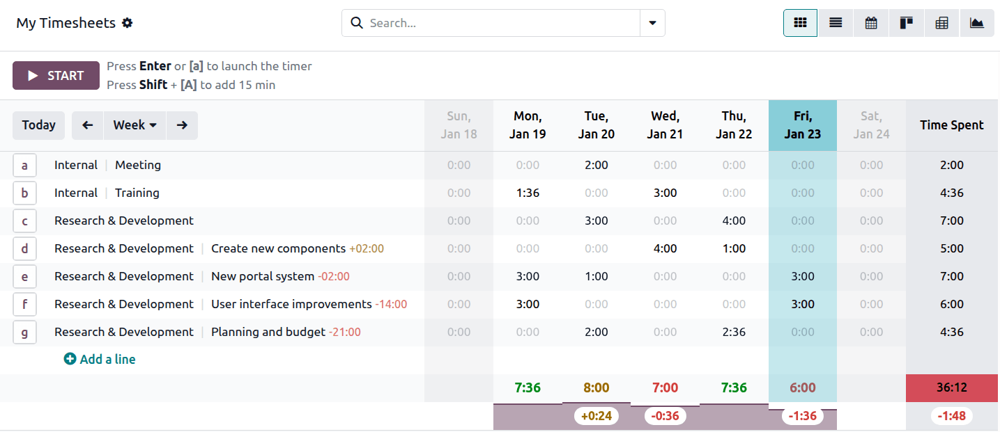

:show-content:

==========
Timesheets
==========

Odoo Timesheets lets you log, view, and validate working time across projects and employees.
Timesheets enable accurate time tracking and productivity monitoring, and in the case of
:doc:`services invoiced on a time-and-material basis </applications/services/timesheets/billing_rates>`,
they are essential for invoicing clients.

.. note::
   Timesheets are also integrated into
   :doc:`Project tasks </applications/services/project/project_management/project_dashboard>` and
   :doc:`Helpdesk tickets </applications/services/helpdesk/advanced/track_and_bill>`.

Configuration
=============

Access rights
-------------

.. note::
   Odoo users must be registered as
   :doc:`employees </applications/hr/employees/new_employee>` to log timesheets.

To define what a user can view and edit in the Timesheets application, configure their access
rights. To do so, open the Settings app, go to :menuselection:`Settings --> Users & Companies -->
Users`, and select the relevant user. Then, under the :guilabel:`Services` section, set the
:guilabel:`Timesheets` field to one of the following:

- :guilabel:`No` (blank): The user cannot see the Timesheets app and cannot log time.
- :guilabel:`User: own timesheets only`: The user can log their own time, but cannot view anyone
  else’s entries.
- :guilabel:`User: all timesheets`: The user can log their own time and view, edit, and validate
  all employees' timesheets.
- :guilabel:`Administrator`: The user can log their own time and view, edit, and validate
  all employees' timesheets; and also access to the Timesheets :guilabel:`Configuration` menu.

Projects
--------

Employees can only log time if the project itself allows it. To enable timesheets for a project,
follow these steps:

#. Go to the Project app.
#. Click the :icon:`fa-ellipsis-v` (:guilabel:`vertical ellipsis`) icon on the relevant project's
   card   and select :guilabel:`Settings`.
#. Go to the :guilabel:`Settings` tab and scroll down to the :guilabel:`Time management` section.
#. Enable :guilabel:`Timesheets`.

Viewing timesheets
==================

By default, the Timesheets app opens to the :guilabel:`My Timesheets` screen in :guilabel:`Grid`
view, displaying the time spent on projects, per day, in each cell; and per period, in the
:guilabel:`Time Spent` column.

To change the displayed period, click on :guilabel:`Week`, then select :guilabel:`Day` or
:guilabel:`Month` in the dropdown menu. Use the :icon:`fa-arrow-left` (:guilabel:`left arrow`) and
:icon:`fa-arrow-right` (:guilabel:`right arrow`) buttons next to it to view previous or upcoming
timesheets.

Click :guilabel:`Today` to return to the current day while keeping you in the selected view.

.. tip::
   Timesheets displayed in italics are suggested entries. They represent projects for which the user
   has not yet logged time during the selected period, but may need to, based on task assignments,
   deadlines, and historical timesheet data.

Hover your mouse over a cell in the grid and click the :icon:`fa-search`
(:guilabel:`fa-search`) icon to view and edit the entry's details, including the
:guilabel:`Date`, :guilabel:`Project`, :guilabel:`Task`, :guilabel:`Description`, :guilabel:`Sales
Order Item` (if the project is billable), and :guilabel:`Time Spent`.

Daily totals
------------

At the bottom of each column, the logged time is color-coded based on the
:ref:`Working Hours defined for the employee <employees/schedule>`:

- **Green**: Logged time matches the expected amount exactly.
- **Brown**: Logged time exceeds the expected amount.
- **Red**: Logged time is less than the expected amount.

.. tip::
   Hover over the purple section below the bottom line to view the overtime/undertime recorded for
   that specific day.

Period totals
-------------

The value in the color-coded cell at the bottom of the :guilabel:`Time Spent` column represents the
total time logged for the period:

- **Green**: Total time matches the expected amount for the period exactly.
- **Orange**: Total time exceeds the expected amount for the period.
- **Red**: Total time is less than the expected amount for the period.

Logging timesheets
==================

Odoo offers multiple ways to log timesheets:

- :ref:`Using the timer <contributing/rst/timer>`
- :ref:`Manually <contributing/rst/log-manually>`
- :ref:`From Project and Helpdesk <contributing/rst/project-helpdesk>`

 .. _contributing/rst/timer:

Using the timer
---------------

To record the time spent on a project in real time, follow these steps:

#. Go to the Timesheets app.
#. Click :guilabel:`Start` to launch the timer.
#. By default, the project most frequently used in the last five timesheet entries is automatically
   selected. To log time for another project, type or select it in the :guilabel:`Project` field.
#. Optionally, select a :guilabel:`Task` in the project and :guilabel:`Describe your activity`.
#. Click :guilabel:`Stop` to stop the timer. The time spent is automatically added to the chosen
   timesheet.

.. tip::
   You can also press **Enter** to start the timer. By default, the project most frequently used in
   the last five timesheet entries is automatically selected. To log time for another project, type
   or select it in the :guilabel:`Project` field.

Alternatively, locate the project you want to log time for in the grid and click or press the letter
displayed next to it on the keyboard to start the timer. Click or press the letter again to stop it.

To add time in 15-minute increments, press Shift + [letter].

 .. _contributing/rst/log-manually:

Manually
--------

To log time manually, click the cell corresponding to the relevant project and day, then enter the
time spent.

If the project is not visible in the grid, click :guilabel:`Add a line`. In the pop-up, select the
:guilabel:`Project`, change the :guilabel:`Date` if needed, and enter the :guilabel:`Time spent`.
Optionally, :guilabel:`Describe your activity` and select a specific :guilabel:`Task`. For
timesheets linked to billable
:doc:`projects </applications/services/project/project_management/project_dashboard>`, include a
:guilabel:`Sales Order Item` so the logged time can be invoiced to the customer.

Click :guilabel:`Save` when finished.

 .. _contributing/rst/project-helpdesk:

From Project tasks and Helpdesk tickets
---------------------------------------

Timesheets can also be logged directly within the Project and Helpdesk apps. To do so, access the
relevant task or ticket, then:

- Either click the :guilabel:`Start` button to start recording time on the task, then click
  :guilabel:`Stop` to stop the timer. In the popup, edit the :guilabel:`Time Spent` if needed, then
  :guilabel:`Describe your activity` and click :guilabel:`Log Time` to record the entry or
  :guilabel:`Resume Timer` to continue tracking time on the task or ticket.

- Or go to the :guilabel:`Timesheets` tab, click :guilabel:`Add a line`, and
  :ref:`fill in the fields <contributing/rst/log-manually>`.

.. seealso::
   `Odoo Tutorials: Project and Timesheets
   <https://www.odoo.com/slides/project-and-timesheets-21>`_

.. toctree::
   :titlesonly:

   timesheets/billing_rates
   timesheets/time_off
